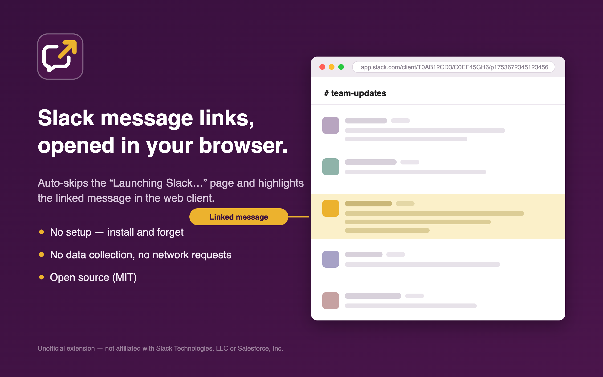

# Open in Browser for Slack

A Chrome extension that opens Slack message links (`https://xxx.slack.com/archives/...`) in the Slack web client in your browser, instead of launching the Slack desktop app, and highlights the linked message. It also works on Chromium-based browsers such as Dia.

This is an unofficial extension and is not affiliated with, endorsed by, or sponsored by Slack Technologies, LLC or Salesforce, Inc.

**[Install from the Chrome Web Store](https://chromewebstore.google.com/detail/open-in-browser-for-slack/jedaiikabimmnoilijklpagegbpeognn)**

## Background

Slack currently handles message links with the following flow:

1. `xxx.slack.com/archives/...` → Slack shows a "Launching &lt;workspace&gt;" interstitial (`data-qa="ssb_redirect_loading_page"`) **on the workspace domain itself** and fires a `slack://` deep link to launch the desktop app.
2. That interstitial offers an "open this link in your browser" escape link, which carries a `skip_today` query param. Clicking it opens the message in `app.slack.com/client/...` and tells Slack to skip the interstitial for the rest of the day.

Existing similar extensions (e.g. "Open Slack in Browser, not App") inject their content script into `*.slack.com/archives/*` but look for a link on `app.slack.com`, so they never run against the interstitial as it is actually rendered today. This extension injects into `https://*.slack.com/archives/*` — the message-link paths where the interstitial actually renders. That covers every workspace subdomain (e.g. `uzabase.slack.com`) without also running the redirect script on the heavy web client (`app.slack.com/client`) or on service subdomains such as `files.slack.com` and `api.slack.com`. (The separate highlight script described below is the one exception: it runs on `app.slack.com/client/*` and exits immediately when the URL carries no message timestamp.)

## How it works

The extension watches for the "open this link in your browser" link with a MutationObserver (and also checks once on load, since the interstitial is server-rendered and the link may already be present) and clicks it as soon as it appears.

The link has no stable `data-qa` of its own, so it is matched by its `skip_today` query param, scoped to the interstitial container (`[data-qa="ssb_redirect_loading_page"]`) so a stray link elsewhere in the web client is never clicked.

Clicking the link (rather than navigating to its href) lets Slack persist the "open in browser today" state (`skip_today`), so subsequent links on the same day open directly in the browser without the interstitial.

### Highlighting the target message

After the redirect lands on the web client (`app.slack.com/client/...`), Slack scrolls to the target message but gives little visual indication of which one it is. A second content script (`highlight.js` + `highlight.css`) fixes this:

1. At `document_start` — before the SPA boots and rewrites the URL — it extracts the target message timestamp from the path (`/p<10 digits><6 digits>`, or a bare `<10>.<6>` segment).
2. It watches the DOM for the message node carrying that timestamp (`data-item-key` / `id`, matched by suffix since thread panes prefix the value with the channel id).
3. Once the node renders, it applies a translucent yellow highlight that holds for a few seconds and fades out. Until the fade completes, a node that loses the highlight (the virtual list recycling the row, or Slack rewriting the row's classes) is re-tagged with a resume offset so the fade continues where it left off instead of restarting.

### Recovering when the client loses the link

Occasionally the web client finishes booting into the channel without ever loading the linked message — you land on the right channel, at the wrong position, with no highlight. On Enterprise Grid the URL is rewritten from the workspace id (`/client/T…/`) to the org id (`/client/E…/`) while the client boots, and if routing has not consumed the deep link before the URL is normalised, the timestamp is dropped and the message is never fetched. It is a race, so it strikes intermittently; a cold, slow load loses more often than a warm one.

Once the timestamp is gone from the URL, Slack has no way back — but the highlight script still holds it, captured at `document_start`. So when the timestamp disappears from the URL (routing has committed) and the message still has not rendered a few seconds later, the script reloads the last URL that still carried the timestamp. That retry is warm and starts from the org-form URL, skipping the redirect the first attempt raced with. It is the same thing you would otherwise do by hand: click the link again.

The retry is flagged in `sessionStorage`, so it happens at most once per tab per message and cannot loop, and it is skipped entirely once you have typed or clicked on the page (a reload would take a half-written message with it).

## Installation

### From the Chrome Web Store (recommended)

Install from the [Chrome Web Store page](https://chromewebstore.google.com/detail/open-in-browser-for-slack/jedaiikabimmnoilijklpagegbpeognn).

### From source (development)

1. Open the extension management page
   - Chrome: `chrome://extensions`
   - Dia: open Extensions from the menu (equivalent to `chrome://extensions`)
2. Enable "Developer mode"
3. Click "Load unpacked" and select this folder

If you install both, disable one of them — two copies would race to click the same link.

After editing the extension (or pulling an update), click the reload icon on its card so the new `manifest.json`, content scripts, and CSS take effect.

If the "Open Slack in Browser, not App" extension is installed, disable it. It never runs on the current message-link flow, but it still injects into other `*.slack.com/archives/*` pages, where it can navigate away or show its failure alert unexpectedly.

## Verifying it works

While Slack's `skip_today` state is active (after choosing "use browser" once that day), the interstitial itself is not shown and links open directly in the browser. To verify the auto-click, test after the state expires — e.g. on the first link click the next day. If the interstitial flashes briefly and you are then taken to the message automatically, it is working.

## Limitations

- Depending on the timing of the `slack://` deep link versus the auto-click, the OS-level "Open Slack.app?" dialog may still appear (the browser navigation itself completes behind the dialog)
- If Slack changes the interstitial DOM (the container `data-qa` or the `skip_today` param), the selector will need to be updated
- The extension watches for the link for 15 seconds per page load; if the interstitial renders later than that (e.g. on a very slow connection), it is not clicked
- The highlight relies on the web client exposing the message timestamp in `data-item-key` / `id` and on the URL still containing the timestamp at `document_start`; if Slack changes either, the highlight silently does nothing (the redirect itself is unaffected)
- The highlight only runs on a fresh page load of `app.slack.com/client/...` (the redirect case); clicking a message link while the web client is already open navigates in-SPA and is not highlighted
- The recovery reload is a single retry per tab; if the client loses the deep link twice in a row you end up on the channel without the message, as you would without the extension
